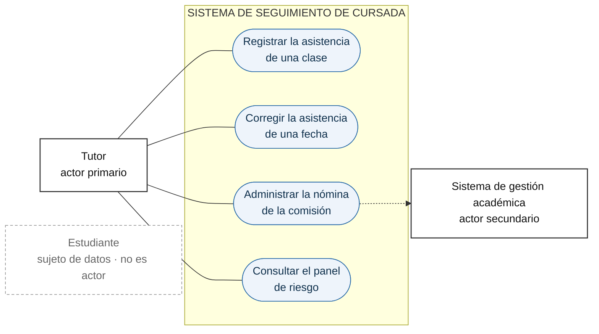
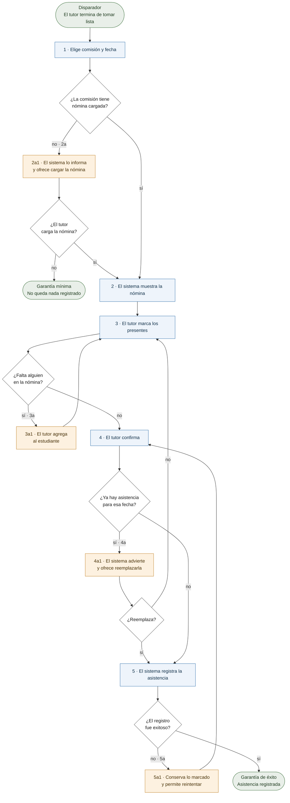

# Historia de usuario y caso de uso

### La confusión de fondo

Una respuesta habitual —*"un caso de uso es más grande, una historia es más chica"*— es la equivocada, o al menos es la menos útil. **La diferencia no es de tamaño sino de propósito**, y el tamaño es una consecuencia de eso.

Un caso de uso existe para **entender**: describe cómo un actor alcanza un objetivo, con todo lo que puede salir mal en el camino. Una historia de usuario existe para **planificar**: marca un pedazo de trabajo lo bastante chico para estimarse y lo bastante valioso para entregarse.

>Los casos de uso y las historias son similares en que ambos son formas de organizar los requisitos. Se diferencian en que se organizan con propósitos distintos. Los casos de uso organizan los requisitos para formar una narrativa sobre cómo los usuarios se relacionan con un sistema y lo utilizan. Por lo tanto, se centran en los objetivos del usuario y en cómo la interacción con el sistema satisface dichos objetivos.
>
>Las historias de usuario dividen los requisitos en fragmentos para fines de planificación. Las historias se desglosan explícitamente hasta que se pueden estimar como parte del proceso de planificación de lanzamiento. Debido a que estos usos de los requisitos son diferentes, las heurísticas para buenos casos de uso e historias también lo serán.
>
> [Martin Fowler](https://martinfowler.com/bliki/UseCasesAndStories.html) 

De ahí sale todo lo demás. El caso de uso se escribe para ser **completo**, porque su valor está en no dejar afuera ningún camino alternativo. La historia se escribe para ser **incompleta a propósito**, porque su valor está en obligar a una conversación que todavía no ocurrió.

### Diferencias conceptuales

| | **Caso de uso** | **Historia de usuario** |
|---|---|---|
| Origen | Jacobson, 1992 (OOSE); formalizado en el Proceso Unificado | Beck, Extreme Programming, fines de los 90 |
| Para qué existe | Entender y acordar el comportamiento del sistema | Planificar y entregar trabajo en iteraciones |
| Qué es | Un **contrato de comportamiento** entre los interesados | Un **recordatorio de una conversación pendiente** |
| Completitud | Aspira a ser completo: incluye todos los caminos alternativos | Deliberadamente incompleto: la tarjeta no alcanza y no debe alcanzar |
| Dónde vive el contenido | En el documento | En la conversación; el documento es el disparador |
| Quién lo escribe | Analista o equipo, con el cliente | Equipo y Product Owner, juntos |
| Ciclo de vida | Largo: sobrevive al proyecto como documentación | Corto: se descarta cuando la funcionalidad está terminada |
| Unidad de qué | De comprensión del dominio | De planificación, estimación y entrega |
| Granularidad típica | Un objetivo completo de nivel usuario | Una rebanada de ese objetivo |
| Relación con el tiempo | Independiente de la iteración | Debe entrar en un sprint, por definición |
| Cómo se valida | Revisión con el cliente | Criterios de aceptación verificados sobre software corriendo |


**El caso de uso es un contrato.** se plantea en esos términos: el caso de uso establece qué garantiza el sistema ante cada situación, incluidas aquellas en que el objetivo del actor no se cumple. Por eso tiene garantías mínimas y de éxito, y por eso enumera extensiones.

**La historia no es un formato de ticket.** Si se la trata como especificación —escrita por una persona, entregada a otra para que la implemente— pierde su función y queda como una especificación mala: demasiado corta para especificar y demasiado formal para conversar.

### Diferencias técnicas

#### Estructura

**Caso de uso completo** :

```
Nombre                     Registrar la asistencia de una clase
Actor primario             Tutor
Interesados e intereses    Tutor: registrar rápido y sin errores
                           Estudiante: que su asistencia quede bien registrada
Precondiciones             El tutor está autenticado y la comisión tiene nómina cargada
Garantía mínima            No se registra asistencia parcial: o se guarda toda o ninguna
Garantía de éxito          Queda registrada la asistencia de todos los estudiantes
Disparador                 El tutor termina de tomar lista
Escenario principal        1. El tutor elige la comisión y la fecha
                           2. El sistema muestra la nómina
                           3. El tutor marca los presentes
                           4. El tutor confirma
                           5. El sistema registra y confirma la operación
Extensiones                2a. La comisión no tiene estudiantes cargados
                             2a1. El sistema lo informa y ofrece cargar la nómina
                           3a. Un estudiante no figura en la nómina
                             3a1. El tutor lo agrega y continúa
                           4a. Ya existe asistencia registrada para esa fecha
                             4a1. El sistema advierte y ofrece reemplazarla
                           5a. Falla el registro
                             5a1. El sistema conserva lo marcado y permite reintentar
Requisitos especiales      Registrar 30 estudiantes en menos de 2 minutos
Frecuencia                 Una vez por clase, por comisión
```

**Las mismas funcionalidades como historias:**

```
Como tutor, quiero marcar presentes y ausentes de una comisión en una fecha,
para tener registrada la asistencia de la clase.

  Dado que la comisión 2°A tiene 30 estudiantes cargados y no hay asistencia
  registrada para el 12/09, cuando el tutor marca 27 presentes y confirma,
  entonces quedan registrados 27 presentes y 3 ausentes para esa fecha.

  Dado que la comisión no tiene estudiantes cargados, cuando el tutor intenta
  tomar asistencia, entonces el sistema lo informa y no permite continuar.

---

Como tutor, quiero corregir la asistencia de una fecha ya registrada,
para arreglar los errores que detecto después de la clase.

  Dado que existe asistencia registrada para el 12/09, cuando el tutor vuelve
  a esa fecha y cambia a Pérez de ausente a presente, entonces el registro
  queda actualizado y se conserva quién y cuándo lo modificó.

---

Como tutor, quiero agregar un estudiante que no figura en la nómina,
para no perder el registro de quien se incorporó tarde.
```

Se ve la relación: **un caso de uso de nivel usuario suele equivaler a varias historias**, y las extensiones del caso de uso son la fuente natural de las historias adicionales y de los criterios de aceptación de los caminos alternativos.

#### Diagramas del caso de uso

Son dos diagramas distintos y contestan preguntas distintas. El de casos de uso contesta **dónde está el límite y quién interactúa**; el de actividad contesta **qué pasa adentro, incluido lo que sale mal**. Ninguno de los dos reemplaza al texto.

**1. Diagrama de casos de uso — el contexto y el límite**



Tres cosas para leer en este diagrama, que son las de los temas 1 y 4 de la unidad:

- **La caja es el límite del sistema.** Lo que está adentro se construye; lo que está afuera es entorno.
- **El estudiante está afuera y sin línea.** Sus datos se procesan, pero no opera el sistema: es sujeto de datos, no actor. Dibujarlo conectado es el error que convierte el proyecto en un campus virtual.
- **El sistema de gestión académica es actor secundario**, y la flecha punteada va del sistema hacia él porque es el sistema quien lo consulta, no al revés.

**2. Diagrama de actividad — el escenario principal y las extensiones**



En azul el escenario principal, en naranja las extensiones. **El escenario principal son 5 pasos y ocupa la columna del medio; todo lo demás es lo que puede salir mal.** Esa proporción es el argumento entero a favor del caso de uso, y se ve mejor en el diagrama que en el texto: si el equipo escribe sólo la historia con su camino feliz, está dejando afuera la mayor parte del comportamiento que después va a tener que programar igual.

Dos observaciones sobre los ciclos de retorno, que son los que el texto plano no muestra bien:

- **La extensión 3a vuelve al paso 3, no al 4.** Después de agregar un estudiante hay que volver a marcarlo, así que el tutor sigue en la pantalla de marcado.
- **La extensión 5a vuelve al paso 4, no al 5.** El reintento es del tutor confirmando otra vez, no del sistema registrando solo. Es una decisión de diseño, y el diagrama obliga a tomarla; el texto la deja ambigua.

Falta un tercer diagrama posible, el de secuencia, que muestra el intercambio de mensajes entre el tutor y el sistema. **No corresponde a esta unidad**: el modelado funcional con diagramas de secuencia está en la Unidad 2 del programa.

#### Tabla comparativa técnica

| | **Caso de uso** | **Historia de usuario** |
|---|---|---|
| Extensión | 1 a 3 páginas en formato completo; un párrafo en formato breve | Una tarjeta más 3 o 4 criterios de aceptación |
| Formatos | Breve, casual y completo (Larman) | Tarjeta, conversación y confirmación (Jeffries) |
| Plantilla | Actor, interesados, precondiciones, garantías, disparador, escenario principal, extensiones | Como *rol*, quiero *capacidad*, para *beneficio* |
| Caminos alternativos | Sección propia y numerada (3a, 3b, 4a…). Es su mayor fortaleza | No los tiene por estructura: hay que ponerlos en los criterios de aceptación |
| Numeración | Pasos numerados, extensiones referidas al paso | Sin numeración interna |
| Estado previo | Precondiciones | El *Dado que* del criterio Given/When/Then |
| Resultado esperado | Garantía de éxito y garantía mínima | El *Entonces* del criterio |
| No funcionales | Sección "requisitos especiales", dentro del propio caso de uso | Fuera: van a la Especificación Suplementaria |
| Estimación | No es la unidad de estimación | Sí: se estima y se prioriza una por una |
| Priorización | Por riesgo y cobertura arquitectónica | Por valor para el usuario y esfuerzo |
| Trazabilidad hacia adelante | Diagramas de secuencia, modelo de dominio, casos de prueba por escenario | Pruebas de aceptación, una por criterio |
| Qué se hace al terminar | Se conserva como documentación | Se descarta; queda la prueba de aceptación |
| Herramienta típica | Documento, wiki, modelo UML | Tarjeta física o ítem de tablero |

#### Sobre el diagrama de casos de uso

Conviene separar dos cosas que suelen ir juntas y no son lo mismo. El **diagrama** de casos de uso muestra actores, la caja del sistema y los óvalos: sirve para ver el límite y el alcance de un vistazo, y no describe comportamiento. El **texto** del caso de uso es donde está el valor: el escenario y las extensiones. Larman es explícito en que los casos de uso son texto, y que el diagrama es un complemento menor.

Las historias no tienen equivalente del diagrama. El artefacto que cumple esa función —dar la vista de conjunto que un backlog plano pierde— es el mapa de historias de Patton.

### Qué pierde cada uno

**Lo que pierde la historia.** Los caminos alternativos. El caso de uso obliga por estructura a preguntarse qué pasa si el estudiante no está en la nómina, si la fecha ya tiene asistencia, si falla el guardado. La historia no obliga a nada de eso, y los equipos escriben el camino feliz y descubren el resto en la demo. **La mitigación es escribir criterios de aceptación que cubran los caminos alternativos**, que es exactamente la sección de extensiones con otro nombre.

**Lo que pierde el caso de uso.** El valor. El caso de uso describe una interacción, no dice por qué vale la pena construirla; la historia tiene el "para" incorporado. Y no es planificable: un caso de uso completo casi nunca entra en una iteración, así que hay que rebanarlo igual, con lo cual el trabajo de dividir aparece de todos modos.

### Complementarios como técnica, excluyentes como artefacto primario

Cockburn, que escribió el libro de referencia sobre casos de uso, firmó el Manifiesto Ágil y trabajó con historias. Él mismo sostiene que no compiten y que una historia suele corresponder a una porción de un caso de uso.

Pero eso vale **como técnica**, no como documentación mantenida. Mantener en paralelo un modelo de casos de uso completo y un backlog de historias es duplicar el mismo contenido en dos lugares que se van a desincronizar, y cuando se contradigan no habrá criterio para saber cuál manda. En ese sentido —el de fuente de verdad— **hay que elegir uno**. Está desarrollado en la anotación 4.

El uso combinado razonable, y el que se aplica en esta materia:

| Momento | Artefacto | Para qué |
|---|---|---|
| Relevamiento | Caso de uso, formato breve o casual | Entender el dominio y descubrir los caminos alternativos |
| Refinamiento del backlog | Historias | Planificar y estimar el sprint |
| Criterios de aceptación | Las extensiones del caso de uso | Ya están enumeradas: se convierten en escenarios Given/When/Then |

El caso de uso se usa y se descarta; **la historia es la que se mantiene**. Dicho de otro modo: el caso de uso sirve para no olvidarse de nada; la historia, para no construir todo junto.

### Fuentes

- [Alistair Cockburn, *Writing Effective Use Cases*](https://people.inf.elte.hu/molnarba/Informaciorendszerek_ELTE/Writing_effective_Use_cases_Cockburn.pdf), cap. 2, "The Use Case as a Contract for Behavior"; cap. 4, "Stakeholders and Actors"; cap. 5, "Three Named Goal Levels"; cap. 8, "Extensions".
- [Alistair Cockburn, — Entrevista sobre casos de uso e historias de usuario](https://www.humanizingwork.com/alistair-cockburn-on-use-cases-user-stories/)
- Jacobson, I., Booch, G. y Rumbaugh, J. (1999). *El Proceso Unificado de Desarrollo de Software*, caps. de captura de requisitos.
- Beck, K. y Andres, C. (2004). *Extreme Programming Explained* (2ª ed.), cap. 7, "Primary Practices", práctica *Stories*.

---

# Épica y feature: qué son, cómo se ordenan y cómo se estructura el software

No hay definiciones canónicas: **"épica" y "feature" no son términos con una definición única y acordada**. Vienen de tradiciones distintas y significan cosas de tamaño muy diferente según quién hable. La jerarquía que la mayoría da por sentada —épica contiene features, feature contiene historias.

### Épica

Para Mike Cohn, que es quien la instaló, **una épica es simplemente una historia grande**: una que no entra en una iteración. No es un tipo distinto de artefacto ni un nivel jerárquico; es una historia que todavía no se dividió.

Sirve para anotar una capacidad importante antes de conocer el detalle, y su destino es dejar de existir: cuando se acerca el momento de construirla, se rebana en historias y la épica desaparece como unidad de trabajo. Dividirla antes es especular; dividirla después es tarde.

### Feature

Acá está el problema, porque la palabra significa tres cosas distintas.

**En FDD (Feature-Driven Development), una feature es chica.** De Luca y Coad la definen como una función con valor para el cliente, expresada con la plantilla *acción + resultado + objeto*: "calcular el total de una venta", "validar la contraseña de un usuario". Deben completarse dentro de un ciclo de dos semanas, y si no entran se dividen. Es decir: **una feature de FDD es más chica que la mayoría de las historias de usuario**, no más grande.
[Fuente](https://en.wikipedia.org/wiki/Feature-driven_development)

**En SAFe, una feature es grande.** Es un nivel intermedio entre la épica y la historia, dimensionado para completarse dentro de un Program Increment de 8 a 12 semanas. La jerarquía completa es Épica → Capability → Feature → Historia, y es una **jerarquía de gobierno**: define qué nivel de la organización decide sobre qué, con qué proceso de aprobación y con qué presupuesto. No es una jerarquía de tamaño, aunque el tamaño la acompañe.
[Fuente](https://framework.scaledagileframework.com/)

### De dónde salió la jerarquía y por qué importa saberlo

La cadena Épica > Feature > Historia se difundió por dos vías: **SAFe**, que la define como estructura de gobierno para organizaciones grandes, y **las herramientas** —Jira, Azure DevOps— que la implementan como tipos de ítem configurados por defecto. La mayoría de la gente la aprendió de la herramienta, no de un libro.

La Guía Scrum, en cambio, sólo tiene **elemento del Product Backlog**. No define épicas, ni features, ni historias de usuario: todo eso viene de XP y de la literatura posterior.


> **Fuente.** Schwaber, K. y Sutherland, J. (2020). *La Guía Scrum*, sección "Product Backlog". https://scrumguides.org/docs/scrumguide/v2020/2020-Scrum-Guide-Spanish-European.pdf

### Cómo se ordenan

**La jerarquía sirve para navegar, no para priorizar**.

Un backlog es una **lista ordenada**, no un árbol. Priorizar un árbol no significa nada, porque no se entrega una rama: se entrega una hoja. Cuando un equipo dice "la épica A es más prioritaria que la B", en realidad está diciendo que las historias de A van primero, y eso sólo es cierto si todas las historias de A valen más que todas las de B, cosa que casi nunca pasa. Lo habitual es que la historia más valiosa de la épica B valga más que la tercera historia de la épica A.

De ahí las tres reglas prácticas:

1. **El orden vive en las historias**, que son la unidad de entrega. La épica agrupa, no prioriza.
2. **Se ordena por valor y por riesgo**, no por completar agrupaciones. Terminar una épica antes de empezar otra es una preferencia estética; se paga con entregar más tarde lo que más valía.
3. **Se rebana en vertical.** Una rebanada que atraviesa varias épicas y entrega algo usable vale más que una épica completa que no se puede demostrar.

### Cómo se estructura el software en función de eso

**El backlog no dicta la estructura del código.**

#### Por qué no

**Tienen vidas distintas.** Una historia vive un sprint y se descarta; una épica desaparece cuando se divide. La estructura del código tiene que sobrevivir años. Organizar carpetas por épica produce una estructura que empieza a mentir en cuanto el backlog se reorganiza, que es siempre.

**Se ordenan por criterios distintos.** El backlog se ordena por valor y riesgo —criterios de negocio, volátiles—. El código se organiza por cohesión y acoplamiento —criterios de diseño, estables—. Son ejes que no tienen por qué coincidir.

**La rebanada vertical es una estrategia de entrega, no un layout.** Que una historia atraviese todas las capas significa que se entrega algo usable, no que su código deba vivir junto en una carpeta con el nombre de la historia. Una carpeta por historia produce duplicación y cero cohesión.

#### Cuál es la relación real

Robert C. Martin (Tio Bob) lo formula como **arquitectura que grita**: la estructura de primer nivel de un sistema debería anunciar de qué se trata el sistema —seguimiento, indicadores, alertas, intervenciones— y no qué framework usa —controllers, models, views—. Si al abrir el repositorio lo primero que se ve es el framework, la estructura está contando la historia equivocada.

Eric Evans llega a lo mismo desde el otro lado: los módulos siguen el lenguaje ubicuo, o sea el vocabulario del cliente. Si el tutor habla de "intervenciones", hay un módulo de intervenciones.

#### En el dominio

Los seis módulos razonables del sistema de seguimiento son conceptos del dominio, no ítems del backlog: cursada y comisiones, registro de asistencia y entregas, cálculo de indicadores, panel de seguimiento, alertas y umbrales, registro de intervenciones. Coinciden con las seis specs porque las specs se escribieron sobre el dominio, no al revés.

Y la relación con las épicas es de muchos a muchos, no de contención:

| Épica | Módulos que toca |
|---|---|
| Ver el riesgo de mi comisión | Cursada · Indicadores · Panel |
| Configurar cómo se calcula el riesgo | Indicadores · Alertas · Panel |
| Registrar lo que hice con cada estudiante | Intervenciones · Panel |
| Cargar la información de la cursada | Cursada · Registro |

El módulo de registro sirve a varias épicas; la épica de configuración toca tres módulos. **La épica es una unidad de entrega vertical; el módulo es una unidad de cohesión horizontal. Se cruzan, no se contienen.**

#### La regla operativa

Organizar el código **por capacidad del dominio**, no por capa técnica y no por ítem del backlog. Cuando alguien pregunta dónde va una clase nueva, la respuesta se busca en el vocabulario del cliente, no en el tablero.

### Fuentes

- Cohn, M. (2004). *User Stories Applied*, cap. 2, "Writing Stories". https://athena.ecs.csus.edu/~buckley/CSc191/User_stories_part_2.pdf
- Cohn, M. — "The Two Ways to Add Detail to User Stories". https://www.mountaingoatsoftware.com/blog/the-two-ways-to-add-detail-to-user-stories
- De Luca, J. y Coad, P. — Feature-Driven Development, definición y plantilla de feature. https://en.wikipedia.org/wiki/Feature-driven_development
- Scaled Agile Framework — jerarquía Epic, Capability, Feature, Story. https://framework.scaledagileframework.com/
- Schwaber, K. y Sutherland, J. (2020). *La Guía Scrum*, sección "Product Backlog". https://scrumguides.org/docs/scrumguide/v2020/2020-Scrum-Guide-Spanish-European.pdf
- Patton, J. (2005). "The New User Story Backlog is a Map". https://jpattonassociates.com/the-new-backlog/
- Martin, R. C. (2017). *Clean Architecture*, cap. 21, "Screaming Architecture", pp. 195-199.
- Evans, E. (2003). *Domain-Driven Design*, cap. 2 y caps. de módulos.
- Farley, D. (2021). *Modern Software Engineering*, caps. 9-11.

---

# BDD y SDD: qué son y en qué se diferencian

### BDD — Behaviour-Driven Development

**Qué es.** Una práctica de **colaboración** antes que de automatización. La idea central: el equipo y el cliente descubren juntos el comportamiento esperado usando **ejemplos concretos**, y esos ejemplos se escriben en el lenguaje del dominio de modo que sirvan a la vez de acuerdo, de especificación y de prueba.

Se suele describir en tres momentos:

| Momento | Qué pasa |
|---|---|
| **Discovery** (descubrimiento) | Conversación estructurada sobre un ejemplo concreto. Es donde está casi todo el valor. |
| **Formulation** (formulación) | Los ejemplos se escriben como Given/When/Then, en lenguaje de negocio. |
| **Automation** (automatización) | Los escenarios se vuelven ejecutables. |

### SDD — Spec-Driven Development

**De dónde salió.** Es reciente —2025-2026— y nació como respuesta al *vibe coding*: pedirle código a un agente en lenguaje natural, aceptarlo sin leerlo y descubrir después que nadie puede explicar qué hace ni por qué. La premisa es que si el agente escribe la mayor parte del código, **el artefacto de mayor apalancamiento que produce un humano pasa a ser la especificación**.

**Qué es.** Un flujo de trabajo en el que la spec es el artefacto primario y el código es un producto derivado. Cuando cambia el requerimiento no se parchea el código: se edita la spec y se regenera.

### Cómo se relacionan

**No compiten: se encastran.** BDD aporta exactamente lo que a SDD más le falta, que es una forma de escribir criterios de aceptación verificables. Una spec cuyos criterios están en Given/When/Then, con datos concretos, es una spec que se puede comprobar —por una persona o por un test—. Una spec en prosa es una spec que el agente completa con lo que le parece.

**TDD, BDD y SDD no son una progresión** ni tres versiones de lo mismo. TDD es una práctica de diseño a nivel de unidad; BDD es una práctica de colaboración a nivel de comportamiento observable; SDD es un flujo de construcción. Operan en niveles distintos y pueden convivir los tres en el mismo proyecto.