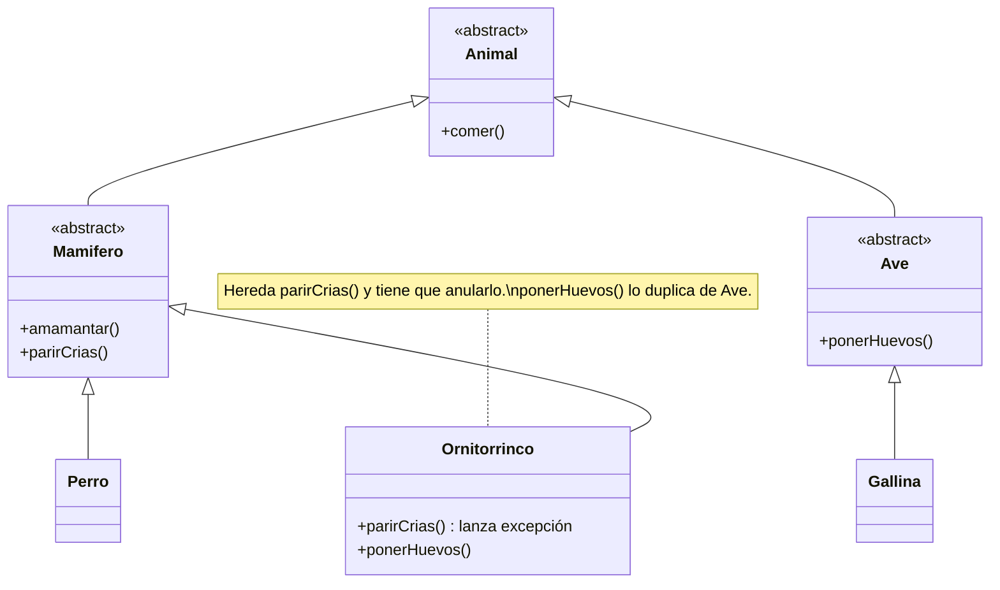
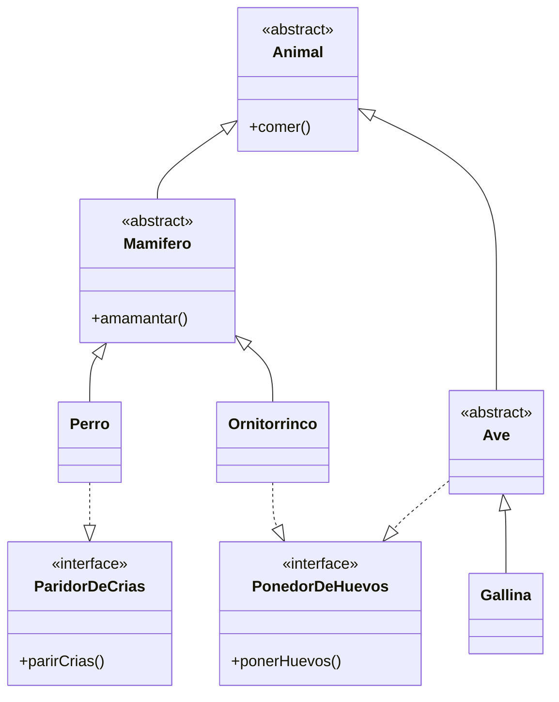

# El problema del ornitorrinco

### Antes de comenzar...

- ¿qué pasa con una jerarquía de clases cuando aparece un caso que no encaja en ninguna rama?
- ¿la herencia sirve para clasificar cosas, o para compartir comportamiento?

Cuando aprendemos herencia, el ejemplo que casi siempre aparece es una jerarquía de animales: un `Animal` arriba, `Mamifero` y `Ave` abajo, y un perro y una gallina en las hojas. Funciona muy bien hasta que alguien pregunta dónde va el ornitorrinco: es un mamífero, amamanta a sus crías, pero pone huevos.

### La versión con herencia

Armamos la jerarquía siguiendo la clasificación: cada rama define lo que hacen "sus" animales.



El ornitorrinco hereda de `Mamifero` porque es un mamífero, pero eso lo obliga a tener un `parirCrias()` que no puede cumplir:

```csharp
public class Ornitorrinco : Mamifero
{
    public override void ParirCrias()
    {
        throw new NotSupportedException("El ornitorrinco pone huevos");
    }

    public void PonerHuevos() { /* duplicado de Ave */ }
}
```

El problema no está en el ornitorrinco, sino en el código que confía en la jerarquía. Este método es correcto para cualquier `Mamifero`... hasta que le pasamos uno:

```csharp
public void RegistrarNacimientos(List<Mamifero> mamiferos)
{
    foreach (var mamifero in mamiferos)
        mamifero.ParirCrias();   // explota con el ornitorrinco
}
```

Las alternativas tampoco ayudan: si lo ponemos debajo de `Ave` deja de ser mamífero, y si hereda de las dos clases (en los lenguajes que lo permiten) nos traemos los conflictos de la herencia múltiple.

### La versión con interfaces

No se trata de tirar la jerarquía, sino de dejar en ella sólo lo que de verdad comparte cada rama. Todos los mamíferos amamantan, así que `amamantar()` se queda en `Mamifero`. La forma de reproducirse, en cambio, varía dentro de la rama: la sacamos a interfaces, y cada animal implementa la que le corresponde.



Fíjense que `Ave` implementa `PonedorDeHuevos` una sola vez, porque todas las aves ponen huevos, y la gallina lo hereda. El ornitorrinco sigue siendo un `Mamifero` y ya no tiene que mentir con un método heredado. Y el código que registra nacimientos pide lo que realmente necesita:

```csharp
public void RegistrarNacimientos(List<ParidorDeCrias> animales)
{
    foreach (var animal in animales)
        animal.ParirCrias();   // el ornitorrinco ni siquiera puede entrar en la lista
}
```

Lo importante es que el error dejó de ser una excepción en tiempo de ejecución y pasó a ser un error de compilación: el diseño no deja escribir el caso que antes explotaba.

### ¿Qué principios aparecen?

- **sustitución de Liskov**: en la primera versión, un `Ornitorrinco` no puede usarse donde se espera un `Mamifero` sin romper el programa;
- **segregación de interfaces**: cada animal implementa sólo lo que hace, y cada cliente depende sólo de lo que usa;
- **abierto-cerrado**: si mañana aparece el equidna, otro mamífero que pone huevos, lo agregamos sin tocar ninguna clase existente.