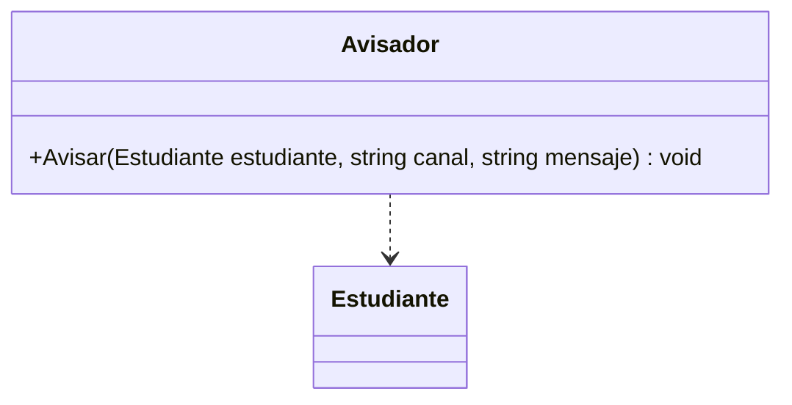
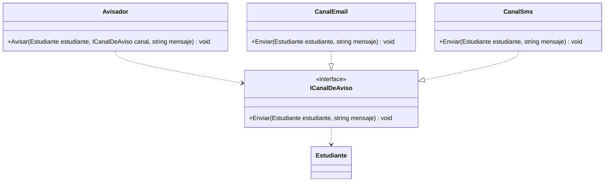

# Ejercicio 1: Open-Closed

## Inicial

```mermaid
classDiagram
    class Avisador {
        +Avisar(Estudiante estudiante, string canal, string mensaje) void
    }
    class Estudiante

    Avisador ..> Estudiante
```

## Mejorado

```mermaid
classDiagram
    class Avisador {
        +Avisar(Estudiante estudiante, ICanalDeAviso canal, string mensaje) void
    }
    class ICanalDeAviso {
        <<interface>>
        +Enviar(Estudiante estudiante, string mensaje) void
    }
    class CanalEmail {
        +Enviar(Estudiante estudiante, string mensaje) void
    }
    class CanalSms {
        +Enviar(Estudiante estudiante, string mensaje) void
    }
    class Estudiante

    Avisador ..> ICanalDeAviso
    CanalEmail ..|> ICanalDeAviso
    CanalSms ..|> ICanalDeAviso
    ICanalDeAviso ..> Estudiante
```
