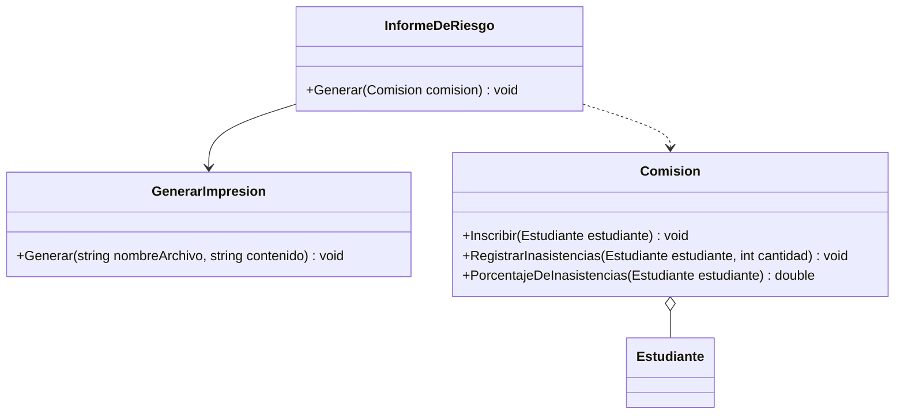
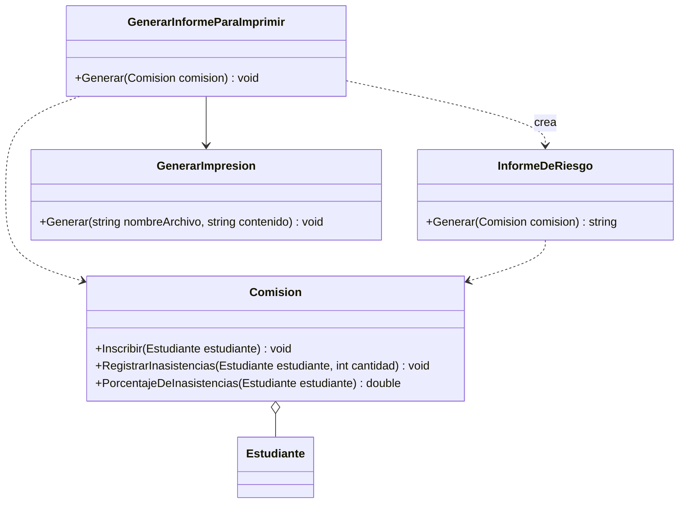

# Ejercicio 2: Single Responsibility

## Inicial

```mermaid
classDiagram
    class InformeDeRiesgo {
        +Generar(Comision comision) void
    }
    class GenerarImpresion {
        +Generar(string nombreArchivo, string contenido) void
    }
    class Comision {
        +Inscribir(Estudiante estudiante) void
        +RegistrarInasistencias(Estudiante estudiante, int cantidad) void
        +PorcentajeDeInasistencias(Estudiante estudiante) double
    }
    class Estudiante

    InformeDeRiesgo --> GenerarImpresion
    InformeDeRiesgo ..> Comision
    Comision o-- Estudiante
```

## Mejorado

```mermaid
classDiagram
    class GenerarInformeParaImprimir {
        +Generar(Comision comision) void
    }
    class InformeDeRiesgo {
        +Generar(Comision comision) string
    }
    class GenerarImpresion {
        +Generar(string nombreArchivo, string contenido) void
    }
    class Comision {
        +Inscribir(Estudiante estudiante) void
        +RegistrarInasistencias(Estudiante estudiante, int cantidad) void
        +PorcentajeDeInasistencias(Estudiante estudiante) double
    }
    class Estudiante

    GenerarInformeParaImprimir ..> InformeDeRiesgo : crea
    GenerarInformeParaImprimir --> GenerarImpresion
    GenerarInformeParaImprimir ..> Comision
    InformeDeRiesgo ..> Comision
    Comision o-- Estudiante
```
