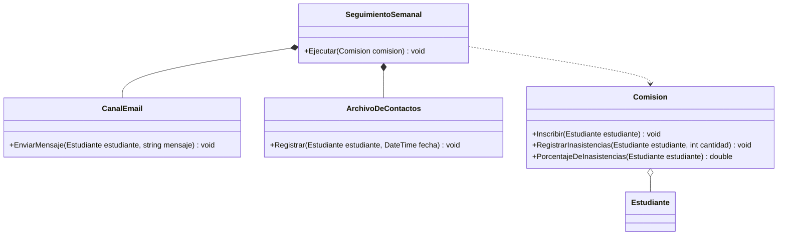
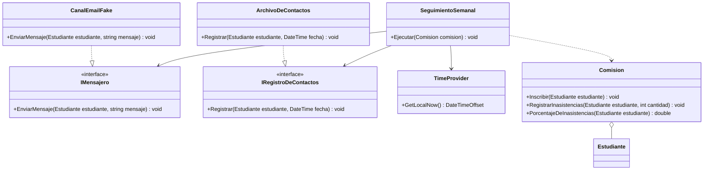

# Ejercicio 3: Inversión de dependencias

## Inicial

```mermaid
classDiagram
    class SeguimientoSemanal {
        +Ejecutar(Comision comision) void
    }
    class CanalEmail {
        +EnviarMensaje(Estudiante estudiante, string mensaje) void
    }
    class ArchivoDeContactos {
        +Registrar(Estudiante estudiante, DateTime fecha) void
    }
    class Comision {
        +Inscribir(Estudiante estudiante) void
        +RegistrarInasistencias(Estudiante estudiante, int cantidad) void
        +PorcentajeDeInasistencias(Estudiante estudiante) double
    }
    class Estudiante

    SeguimientoSemanal *-- CanalEmail
    SeguimientoSemanal *-- ArchivoDeContactos
    SeguimientoSemanal ..> Comision
    Comision o-- Estudiante
```

## Mejorado

```mermaid
classDiagram
    class SeguimientoSemanal {
        +Ejecutar(Comision comision) void
    }
    class IMensajero {
        <<interface>>
        +EnviarMensaje(Estudiante estudiante, string mensaje) void
    }
    class IRegistroDeContactos {
        <<interface>>
        +Registrar(Estudiante estudiante, DateTime fecha) void
    }
    class TimeProvider {
        +GetLocalNow() DateTimeOffset
    }
    class CanalEmailFake {
        +EnviarMensaje(Estudiante estudiante, string mensaje) void
    }
    class ArchivoDeContactos {
        +Registrar(Estudiante estudiante, DateTime fecha) void
    }
    class Comision {
        +Inscribir(Estudiante estudiante) void
        +RegistrarInasistencias(Estudiante estudiante, int cantidad) void
        +PorcentajeDeInasistencias(Estudiante estudiante) double
    }
    class Estudiante

    SeguimientoSemanal --> IMensajero
    SeguimientoSemanal --> IRegistroDeContactos
    SeguimientoSemanal --> TimeProvider
    SeguimientoSemanal ..> Comision
    CanalEmailFake ..|> IMensajero
    ArchivoDeContactos ..|> IRegistroDeContactos
    Comision o-- Estudiante
```
